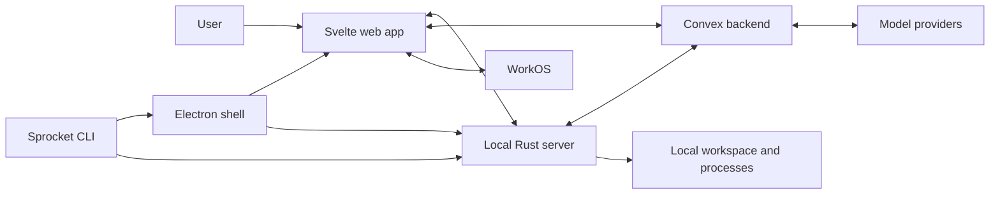
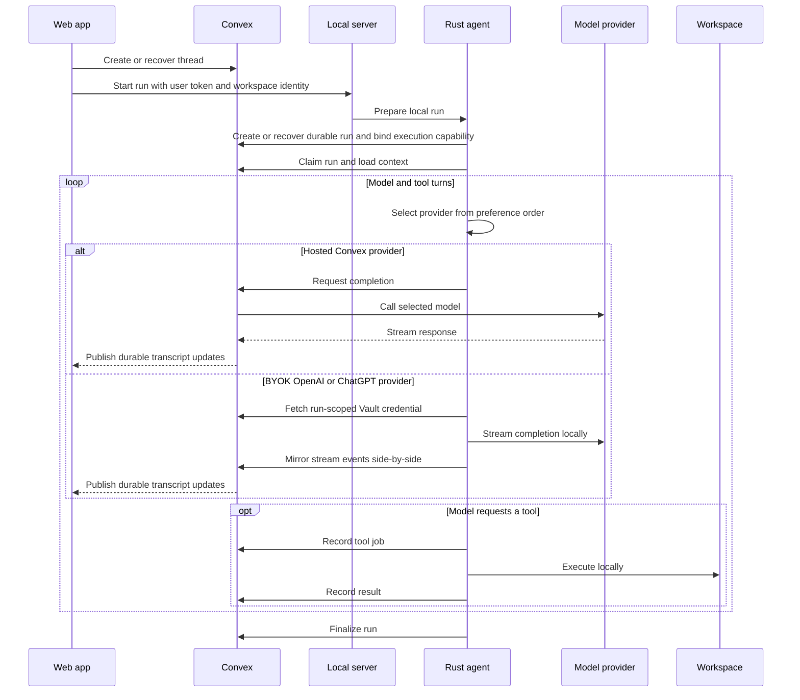

# Sprocket Architecture

Sprocket is a local-first agentic development environment for robotics. Its web
interface and durable conversation state are cloud-connected, while filesystem
access and command execution stay on the user's machine.

This document describes the stable system boundaries and data flows. User setup
belongs in [README.md](README.md); crate-specific implementation notes live in
the READMEs under [`crates/`](crates/).

## Design principles

- **Local execution:** source files, patches, and shell processes are handled by
  a local Rust process, not by the cloud backend.
- **Durable coordination:** conversations and agent-run state survive browser,
  process, and network interruptions.
- **Explicit ownership:** authenticated cloud records belong to a user, and
  active agent work belongs to a renewable run claim.
- **Portable clients:** the same web application runs in a browser, during Vite
  development, and inside Electron.
- **Layered implementation:** workspace primitives do not depend on HTTP,
  Convex, or model providers.

## System overview



The system has three main planes:

1. **Client plane:** Svelte provides the UI; Electron supplies a desktop shell;
   the CLI launches clients and the local server.
2. **Local execution plane:** the Rust server authenticates local requests,
   resolves workspace attachments, starts agent runs, and executes tools.
3. **Cloud coordination plane:** Convex stores durable application state,
   coordinates run ownership, streams responses, and calls model providers.

WorkOS establishes cloud user identity. A separate local pairing mechanism
authorizes the browser or Electron renderer to access the machine-facing API.

## Component boundaries

| Component               | Owns                                                             | Does not own                          |
| ----------------------- | ---------------------------------------------------------------- | ------------------------------------- |
| Svelte app              | User interaction, reactive views, submission recovery            | Filesystem access or provider secrets |
| Electron shell          | Desktop lifecycle, trusted renderer bridge, local server process | Conversation or agent state           |
| CLI                     | Process launch and server-mode selection                         | Agent implementation                  |
| Local server            | Local authorization, workspace attachment, agent task lifetime   | Durable conversation state            |
| Agent runtime           | Run claim, model/tool loop, cancellation, finalization           | HTTP presentation or cloud schema     |
| Workspace crate         | Paths, commands, patches, workspace instructions                 | Authentication or networking          |
| Convex provider adapter | Rig-to-Convex completion translation                             | Model selection policy                |
| Convex backend          | User data, run coordination, transcript, model access            | Local paths and process execution     |

The Rust dependency direction follows these boundaries:

```text
sprocket-cli -> sprocket-server -> sprocket-agent -> sprocket-convex-provider
       |              |                |
       +--------------+----------------+-> sprocket-workspace
```

Lower layers remain usable without importing higher-level concerns.

## Runtime modes

### Desktop

The CLI launches Electron. Electron attaches to a compatible local server or
starts the packaged Rust executable, then loads the same web build used by the
browser mode. A narrow preload bridge exposes desktop-only actions to the
renderer.

### Browser

The CLI starts or reuses a local server and opens the locally served web app.
The server hosts both the static application and its machine-facing API.

### Development

Vite serves the web app while the Rust process serves only the local API.
Requests to the API are proxied during development so the application code uses
the same paths in every runtime mode.

## State ownership

Sprocket deliberately separates cloud and machine-local state.

| State                                                                      | Owner                |
| -------------------------------------------------------------------------- | -------------------- |
| Users, workspace identities, threads, messages, runs, and tool-job records | Convex               |
| Workspace identity to local path mapping                                   | Local server         |
| Pairing credential and local browser sessions                              | Local server         |
| Active commands, cancellation tokens, and run execution capabilities       | Local process memory |
| Source files and build artifacts                                           | User workspace       |
| Hosted model and authentication provider secrets                           | Cloud deployment     |
| User BYOK provider secrets (OpenAI API keys, ChatGPT auth.json)            | WorkOS Vault         |

A cloud workspace identity never needs to expose its machine path. The web app
joins cloud workspace metadata with the local server's attachment state.

## Agent run flow



The submission identifier makes thread and run creation safe to retry after an
ambiguous network failure. Once started, a worker must hold a renewable claim;
stale workers cannot continue tool execution or overwrite a newer result.

Tool operations are recorded before and after local execution. This gives the
UI a durable audit trail and lets terminal run state cancel work still running
on the machine.

Model output is persisted incrementally by Convex. Stream attempt and ordering
metadata prevent a delayed completion attempt from replacing a newer one.

Provider preference is per-user and ordered (default: `convex`, `chatgpt`,
`openai`). The local agent tries each configured provider that can serve the
selected model, and falls back only before any durable stream events have been
merged for the current attempt. Model completions through BYOK keys or ChatGPT
subscription auth don't count against Sprocket subscription usage limits.
ChatGPT credentials are stored as Codex-style `auth.json` in WorkOS Vault.

## Authentication and trust boundaries

Cloud and local authorization solve different problems:

- **Cloud identity:** WorkOS tokens authenticate the user to Convex. Convex
  checks ownership before reading or changing user records.
- **Local authorization:** a machine-local pairing credential bootstraps a
  local session used for filesystem and agent endpoints.
- **Agent delegation:** the browser provides a fresh user token only to create
  the run. Convex then binds a random, run-scoped capability to that run, and
  the local executor uses it without depending on the browser session.
- **Provider secrets:** hosted model keys stay in the Convex deployment
  environment. User BYOK OpenAI keys and ChatGPT `auth.json` live in WorkOS
  Vault and are decrypted only for a claimed run through an
  execution-secret-gated action; the local agent may hold them in memory (and
  a temp auth file for ChatGPT) for the run only.
- **Desktop trust:** Electron isolates the renderer, validates its origin, and
  exposes only a constrained IPC surface.

The local server binds to loopback by default. Exposing it on another interface
changes the trust model and should be treated as a security-sensitive
deployment choice.

Workspace patches are confined to the attached workspace. Shell commands are
not sandboxed: they run with the permissions of the local Sprocket process.

## Reliability model

The distributed run protocol assumes that requests can time out after either
succeeding or failing. Its main safeguards are:

- idempotent creation keyed by a client submission identifier;
- request-independent local launch and run-scoped executor capabilities;
- renewable claims that reject stale workers;
- durable transcript and tool-job updates;
- explicit terminal states and failure reconciliation;
- cancellation propagated from durable state to local operations;
- bounded command output and process-tree termination; and
- transactional workspace patches with rollback.

These behaviors are cross-layer contracts. Changes to run ownership,
cancellation, tool payloads, history representation, or streaming must be made
in the Rust agent and Convex backend together.

## Repository layout

| Path                               | Responsibility                        |
| ---------------------------------- | ------------------------------------- |
| `apps/web/`                        | Svelte application and Convex backend |
| `apps/desktop/`                    | Electron shell and packaging          |
| `crates/sprocket-cli/`             | User-facing launcher                  |
| `crates/sprocket-server/`          | Local HTTP and process boundary       |
| `crates/sprocket-agent/`           | Agent run lifecycle and tools         |
| `crates/sprocket-convex-provider/` | Rig completion adapter                |
| `crates/sprocket-workspace/`       | Local workspace primitives            |
| `packages/`                        | Shared JavaScript configuration       |

## Build and deployment

The web app is built as static assets. Installed desktop packages combine those
assets with Electron and the native Sprocket executable. A standalone CLI
bundle includes the native executable and the assets needed for browser mode.

The local executable receives only public runtime configuration. Hosted WorkOS
and model-provider secrets remain in the Convex deployment. User BYOK keys are
stored in WorkOS Vault and never persisted in Convex or on disk locally.

## Validation

Run checks relevant to a change from the repository root:

```sh
cargo test
bun run test
bun run build
prek run -a
```

After changing Convex code, validate the deployment functions from `apps/web/`
as described in [AGENTS.md](AGENTS.md).
