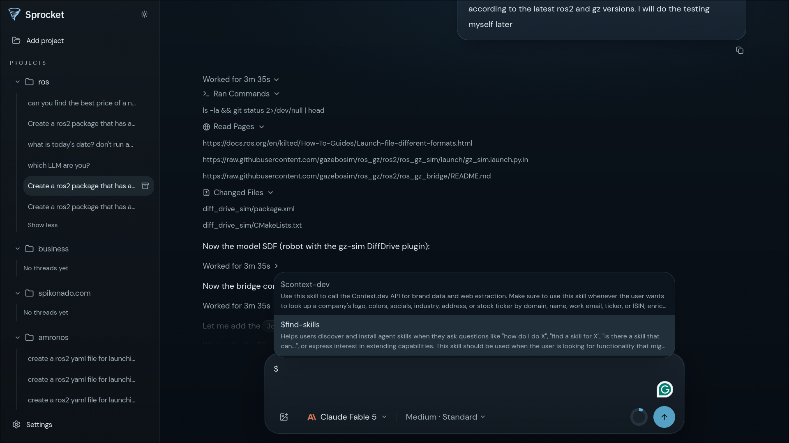

# Sprocket

**Goal**: To make the world's best platform for developing hardware and software.

Sprocket is currently a lightweight coding agent that writes high-quality code, and retrieves best-in-class context from the web and open-source projects.




## Using Sprocket

### Run without installing

```sh
npx @spikonado/sprocket --web
```

### Desktop App

Install `sprocket-desktop` for your OS from the latest [GitHub Release](https://github.com/spikonado/sprocket/releases) and run it.

### CLI

```sh
npm i -g @spikonado/sprocket
sprocket --web
```

`--web` starts the local server and opens Sprocket in your default browser.

The CLI doesn't ship with Electron; the desktop app does.

If you have the desktop app installed, you can also run `sprocket` in your terminal to launch it:

```sh
sprocket
```

With no flags, the CLI looks for `sprocket-desktop` (on `PATH`, common install locations, or `SPROCKET_DESKTOP_EXECUTABLE`) and launches it. The desktop app brings up its own UI and local server. If the desktop app is not installed, `sprocket` errors and tells you to install it or use `--web`.

### Workspaces

Pass a directory to open or reconnect that workspace in a new thread:

```sh
sprocket .
sprocket --web ../my-robot
```

Sprocket remembers attached workspaces and local server sessions between launches.
Local state lives in `$HOME/.sprocket` (or `%USERPROFILE%\.sprocket` on Windows when `HOME` is unset).
Override with `SPROCKET_DATA_DIR`.

## CLI reference

| Command                      | Behavior                                                                        |
| ---------------------------- | ------------------------------------------------------------------------------- |
| `sprocket [DIRECTORY]`       | Launch the installed `sprocket-desktop` app, optionally opening a workspace.    |
| `sprocket --web [DIRECTORY]` | Start the local server and open the browser UI, optionally opening a workspace. |
| `sprocket serve`             | Run the local server in the foreground without launching a client.              |
| `sprocket serve --api-only`  | Serve only `/api`; intended for development (see [Development](#development)).  |

Run `sprocket --help` or `sprocket serve --help` for all options.
Common server overrides are also available as environment variables:

| Variable                      | Purpose                                                             |
| ----------------------------- | ------------------------------------------------------------------- |
| `SPROCKET_HOST`               | Bind host; defaults to `127.0.0.1`.                                 |
| `SPROCKET_PORT`               | Local server port; defaults to `17731` for installed use.           |
| `SPROCKET_DATA_DIR`           | Directory for pairing, sessions, and workspace state.               |
| `SPROCKET_STATIC_DIR`         | Web build to serve instead of the bundled build.                    |
| `SPROCKET_DESKTOP_EXECUTABLE` | Full path to `sprocket-desktop` when it is not found automatically. |
| `PUBLIC_CONVEX_URL`           | Convex deployment used by the agent runtime.                        |

## Development

### Requirements

- Bun 1.x, version 1.3.9 or newer
- Node.js 24.x, version 24.14 or newer
- A current stable Rust toolchain

Install dependencies:

```sh
bun install
```

### Running Sprocket

Start the browser development environment:

```sh
bun dev
```

After creating a convex deployment and configuring authkit following the instructions, configure the Convex deployment with the API key for each model provider you want to enable.

This runs Vite at `http://localhost:5173` and the Rust API at `http://127.0.0.1:7731`, with development state kept in `.sprocket-dev` inside the repository.
To develop against Electron instead, run:

```sh
bun dev:desktop
```

### Building and testing

```sh
cargo test
bun run test
bun run build
prek run -a
```

Create a local Electron installer package with:

```sh
bun run build:release
```

Artifacts are written to `apps/desktop/dist/` as `sprocket-desktop-*` (`.AppImage` / `.dmg` / `.exe` depending on the host OS).
Published installers come from GitHub Releases; the `sprocket` CLI is published separately on npm.

## Troubleshooting

- If `17731` is already occupied, set `SPROCKET_PORT` before launching.
- If `sprocket` cannot find the desktop app, install it from [GitHub Releases](https://github.com/spikonado/sprocket/releases), set `SPROCKET_DESKTOP_EXECUTABLE` to its full path, or use `sprocket --web`.
- Unsigned macOS and Windows desktop builds may need a Gatekeeper / SmartScreen override the first time you open them.
- Contact [aarav@spikonado.com](mailto:aarav@spikonado.com) for help.
